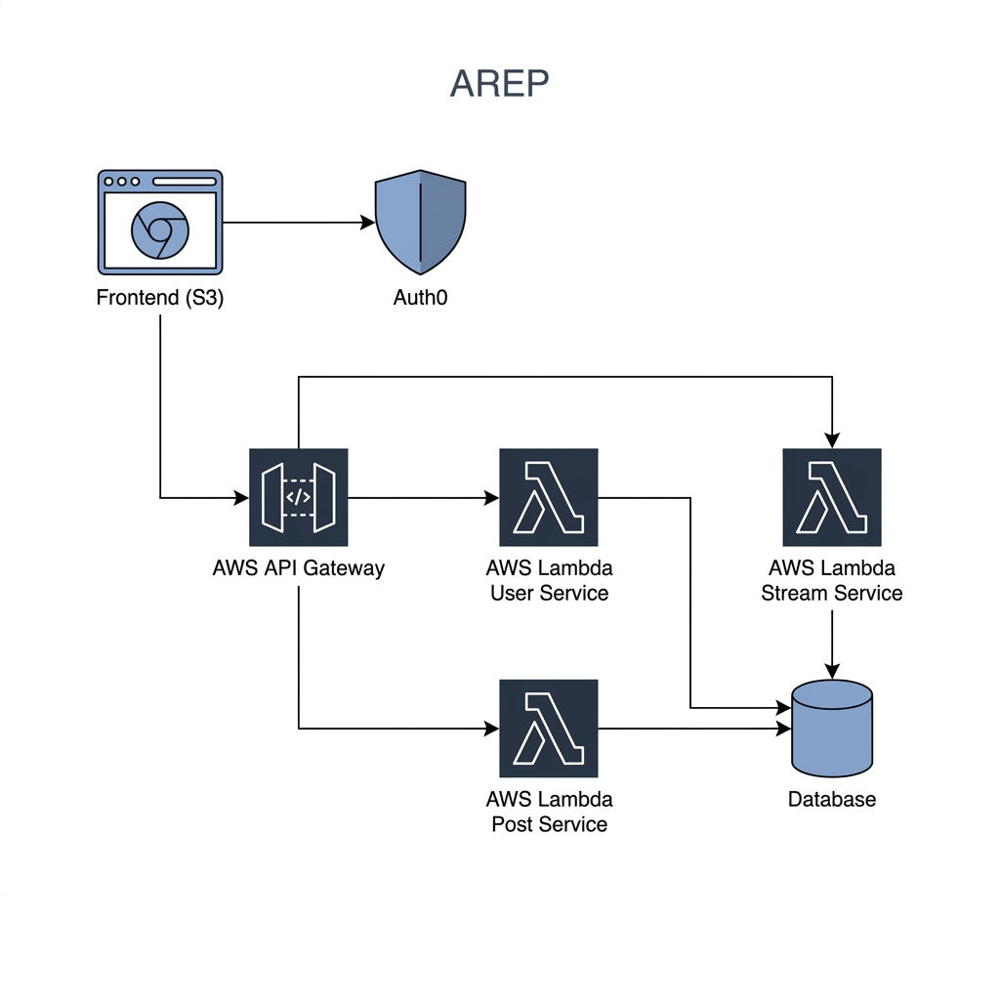
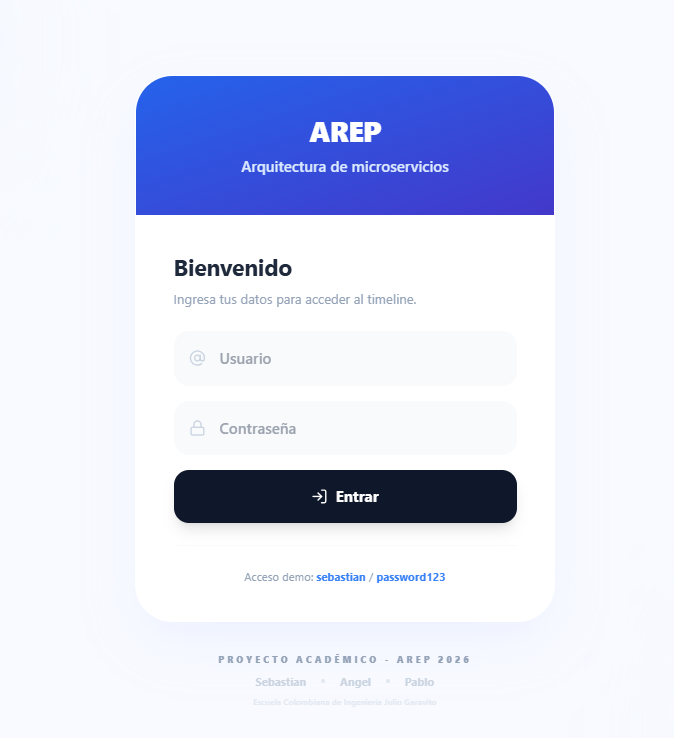
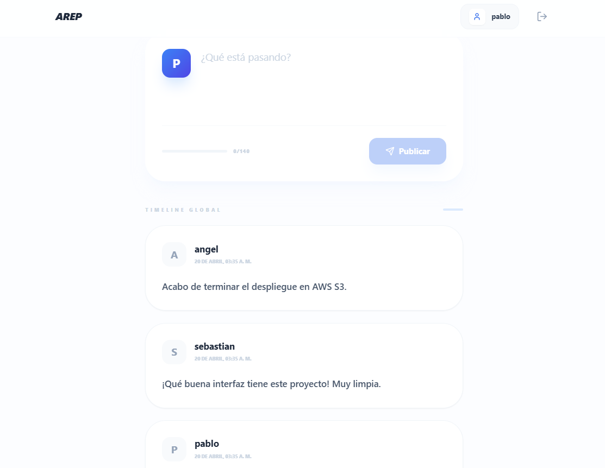
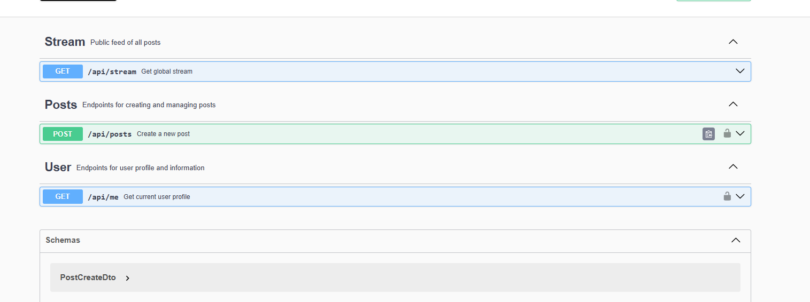

# Informe Técnico Final: Aplicación de Microservicios AREP
## De un Monolito a una Arquitectura Serverless con Auth0

**Universidad:** Escuela Colombiana de Ingeniería Julio Garavito  
**Materia:** Sistemas Distribuidos y Arquitecturas de Software (AREP)  
**Estudiantes:** Sebastian Buitrago, Angel Cuervo, Pablo Nieto  
**Fecha:** Abril 2026

---

## 1. Introducción y Definición del Problema

### El Desafío
En el desarrollo de aplicaciones modernas, la transición desde arquitecturas centralizadas hacia ecosistemas distribuidos es fundamental para garantizar escalabilidad y mantenibilidad. El problema planteado en este proyecto es la construcción de una plataforma de micro-blogging (estilo Twitter) llamada **AREP**, que debe cumplir con estrictos estándares de seguridad y ser capaz de evolucionar desde una solución monolítica local hacia un entorno **Serverless en la nube de AWS**.

### Objetivos del Proyecto
1.  **Desarrollo de Monolito:** Crear un núcleo robusto en Spring Boot que gestione Usuarios, Posts y un Feed Global.
2.  **Seguridad Mandatoria:** Implementar autenticación y autorización mediante **Auth0**, utilizando el estándar OAuth2/OIDC.
3.  **Refactorización a Microservicios:** Desacoplar la lógica de negocio en funciones independientes.
4.  **Despliegue Serverless:** Migrar la infraestructura a AWS Lambda y API Gateway con alojamiento estático en S3.

---

## 2. Arquitectura de la Solución

### Evolución Arquitectónica
La solución se basó en dos fases clave:

#### Fase 1: Monolito de Referencia
Se construyó un backend monolítico con **Spring Boot 3.2** y una base de datos **H2 (In-memory)**. Este componente permitió estabilizar el modelo de dominio y validar la documentación automática de la API mediante **Swagger (OpenAPI 3.0)**.

#### Fase 2: Ecosistema Serverless
Utilizando el **Serverless Framework**, el monolito se dividió en tres microservicios críticos:
-   **User Service:** Gestión de perfiles y claims de identidad.
-   **Posts Service:** Validación de límites (140 chars) y persistencia de mensajes.
-   **Stream Service:** Agregación de posts en tiempo real para el feed global.

### Diagrama de Arquitectura (Diseño Serverless)


---

## 3. Seguridad e Identidad (Auth0)

La seguridad no es una capa adicional, sino el núcleo del diseño. Se configuró un **Tenant en Auth0** con las siguientes especificaciones:
-   **SPA Application:** Configurada con URLs de callback para localhost (desarrollo) y S3 (producción).
-   **API Definition:** Se definió un *Audience* único (`https://api.arep.com`) para validar que los tokens emitidos solo sean válidos para nuestros microservicios.
-   **Validación:** El Backend actúa como un **Resource Server**, validando la firma asimétrica (públicas/privadas) de los tokens JWT emitidos por Auth0.

---

## 4. Guía de Despliegue en AWS (Paso a Paso)

### 4.1 Despliegue del Frontend (AWS S3)
El frontend se aloja como un sitio web estático para maximizar la velocidad y reducir costos.
1.  **Build:** Se generaron los archivos de producción con `npm run build`.
2.  **Bucket S3:** Se creó el bucket `arep-frontend-2026`.
3.  **Configuración:** Se habilitó el "Static Website Hosting" y se configuró la siguiente política de acceso:
    ```json
    {
      "Version": "2012-10-17",
      "Statement": [{
        "Effect": "Allow",
        "Principal": "*",
        "Action": "s3:GetObject",
        "Resource": "arn:aws:s3:::arep-frontend-2026/*"
      }]
    }
    ```

### 4.2 Despliegue de Microservicios (AWS Lambda)
Se utilizó **AWS Lambda** para eliminar la necesidad de gestionar servidores (EC2).
1.  **Separación:** Se crearon handlers individuales para cada operación.
2.  **API Gateway:** Se configuró como la puerta de enlace, mapeando rutas `/api/posts` y `/api/stream` hacia sus respectivas Lambdas.
3.  **Despliegue con CLI:**
    ```bash
    cd microservices
    serverless deploy --stage prod
    ```

---

## 5. Galería de Funcionamiento

### Interfaz del Estudiante - Login
He diseñado una ventana de acceso limpia que separa la lógica de autenticación del contenido principal.


### Timeline Global - AREP
El feed utiliza **Skeleton Loaders** para una transición visual suave mientras las Lambdas responden.


### Documentación Técnica - Swagger
Cada endpoint está documentado con sus códigos de respuesta (200, 201, 401, 403).


---

## 8. Video de Demostración
En este video realizamos un recorrido completo por la aplicación, explicando la arquitectura, el flujo de seguridad con Auth0 y demostrando el funcionamiento de los microservicios en AWS.

<video controls src="./docs/demo_arep.mp4" title="Demostración AREP"></video>

**Contenido del video:**
- Explicación del diagrama de arquitectura.
- Flujo de autenticación con Auth0.
- Creación de publicaciones y visualización en el feed global.
- Verificación del endpoint protegido `/api/me`.

---

## 9. Guía de Ejecución Local y Réplica

### Ejecución con Docker (Entorno Monolítico)
Para replicar el comportamiento de la Fase 1:
```bash
docker-compose up -d --build
```
-   **Frontend:** [http://54.161.22.45:3000](http://54.161.22.45:3000)
-   **Swagger:** [http://54.161.22.45:8080/swagger-ui/index.html](http://54.161.22.45:8080/swagger-ui/index.html)

### Credenciales Mock para Evaluación:
-   **User:** `sebastian` | **Pass:** `password123`
-   **User:** `angel` | **Pass:** `password123`

---

## 7. Conclusiones y Análisis de Resultados
- **Escalabilidad:** Al pasar a AWS Lambda, la aplicación escala automáticamente con cada petición, sin costo por tiempo de inactividad.
- **Seguridad:** El uso de Auth0 eliminó la necesidad de gestionar contraseñas en texto plano o bases de datos vulnerables, delegando la identidad a un estándar industrial.
- **UX:** Se aplicaron reglas de *Interaction Design (IX)* para asegurar que el usuario siempre tenga feedback visual (Toasts, Skeletons).

---
*Este proyecto es de autoría original y cumple con todos los criterios de la Tarea de Microservicios AREP.*
